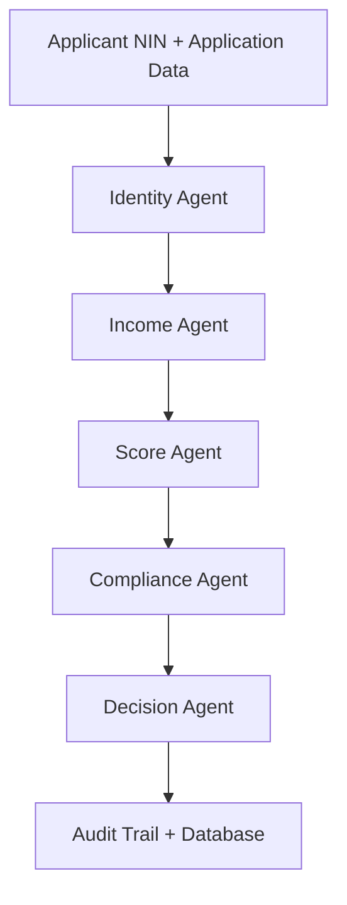

# RinSathi: Autonomous Credit & Lending Orchestrator

[](https://fastapi.tiangolo.com)
[](https://www.python.org/)
[](https://supabase.com)

RinSathi is a FastAPI-based lending orchestration system for Nepalese microfinance workflows. It combines government identity verification, income normalization, risk scoring, compliance checks, and final decisioning in a shared-state pipeline.

The current implementation uses NIN-based identity verification instead of document-image extraction. That keeps the pipeline tied to authoritative data sources while preserving the same downstream state contract for scoring and compliance.

## What It Does

RinSathi routes each loan application through five agents:



The identity step verifies the applicant against government sources and populates shared state with verified fields and land-asset context. The income agent normalizes cashflow data, the score agent predicts repayment likelihood, the compliance agent applies NRB-style guardrails, and the decision agent produces the final verdict.

## Key Modules

`agents/identity_agent.py` verifies identity and land data from the mock government APIs.
`agents/income_agent.py` combines income sources into a normalized monthly estimate.
`agents/score_agent.py` generates the repayment score and SHAP-based explanations.
`agents/compliance_agent.py` applies policy thresholds and risk rules.
`agents/decision_agent.py` converts the pipeline output into Recommend, Refer, or Reject.

`api/routes/loan.py` is the main application endpoint.
`api/routes/income.py` exposes the income analysis route.
`routers/auth.py`, `routers/client.py`, `routers/officer.py`, and `routers/mock_gov.py` support the rest of the app surface.

## Technology Stack

FastAPI powers the API layer.
PostgreSQL via Supabase stores applicants, documents, and audit logs.
XGBoost and SHAP provide the underwriting model and explanations.
Pydantic v2 defines the shared state and API schemas.

## Project Layout

```bash
RinSathi/
├── agents/              # Multi-agent pipeline logic
├── api/                 # API schemas and routes
├── core/                # Security helpers
├── db/                  # SQLAlchemy models and session setup
├── frontend/            # Static HTML, CSS, and browser assets
├── ml/                  # Training script and saved model
├── routers/             # Web route modules
├── services/            # Application services
├── tests/               # Validation and regression scripts
├── utils/               # Income parsing, SHAP formatting, helpers
├── config.py            # Environment-driven configuration
├── main.py              # FastAPI entrypoint
├── requirements.txt     # Python dependencies
└── alembic.ini          # Alembic configuration
```

## Quick Start

### 1. Prerequisites

Install Python 3.10 or newer.

### 2. Create a Virtual Environment

```powershell
python -m venv venv
.\venv\Scripts\Activate.ps1
pip install -r requirements.txt
```

### 3. Configure Environment Variables

Create a `.env` file in the project root:

```env
DATABASE_URL=postgresql://<user>:<password>@<host>:<port>/<dbname>
SECRET_KEY=your-jwt-signing-secret
APPROVE_THRESHOLD=0.65
REFER_THRESHOLD=0.40
MIN_KYC_CONFIDENCE=0.70
MAX_LOAN_TO_ASSET=0.75
AML_TXN_LIMIT_NPR=1000000
AGRI_SECTOR_LIMIT_NPR=500000
```

### 4. Run Migrations

```bash
alembic upgrade head
```

### 5. Start the App

```bash
uvicorn main:app --reload
```

Open `http://localhost:8000/docs` for Swagger UI and `http://localhost:8000/redoc` for ReDoc.

## Main Endpoints

`GET /health` returns the service health summary.
`POST /api/v1/loan/apply` runs the full underwriting pipeline.
`POST /api/v1/income/analyze` analyzes income signals independently.

## Configuration Notes

`APPROVE_THRESHOLD` and `REFER_THRESHOLD` control the score-based decision band.
`MIN_KYC_CONFIDENCE` governs when identity quality triggers manual review.
`MAX_LOAN_TO_ASSET`, `AML_TXN_LIMIT_NPR`, and `AGRI_SECTOR_LIMIT_NPR` enforce compliance rules.

If you need the retired document-image workflow, it has been intentionally removed from this codebase and is no longer part of the documented flow.
